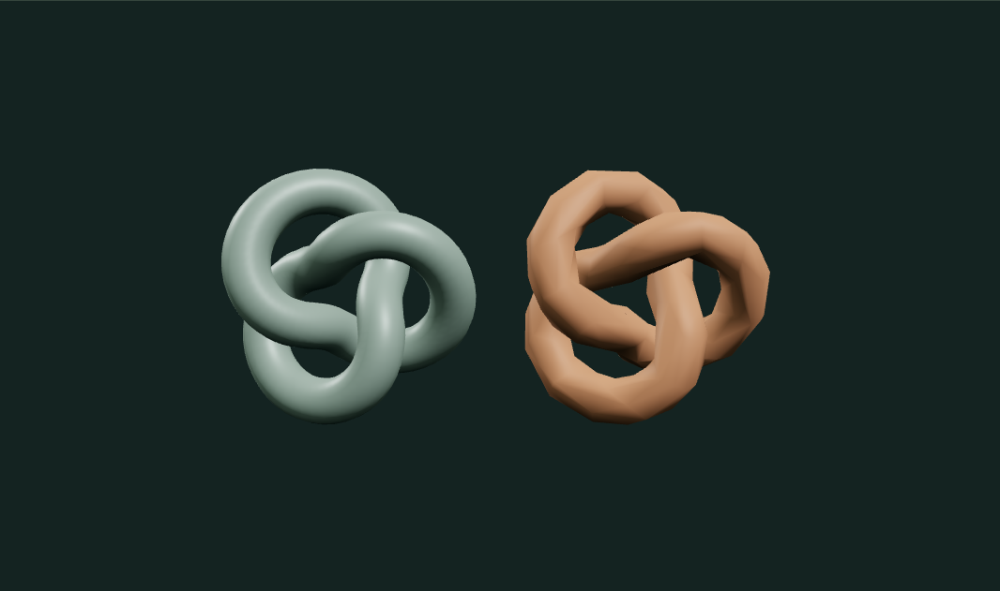
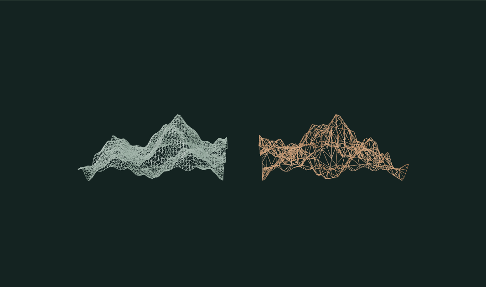

# Polygon Budget Lab

A real mesh reduction tool using area-weighted quadric error metrics. Each triangle contributes a plane-error quadric. A priority queue selects low-cost edge collapses; candidate positions include the quadric optimum, endpoints and midpoint. Local link-condition checks reject topology-changing collapses, and face-normal tests reject inversions. Optional boundary locking fixes every original open-rim vertex.

Simplification runs in a Web Worker. The UI reports actual source and result triangle counts, reduction percentage, and early stopping when the requested budget is incompatible with the constraints. Compare a braided knot, a ribbed lathed vessel, or a terrain tile. OBJ upload and reduced OBJ export operate on real geometry.

## Limits

12,000 source triangles, 2 MB OBJ uploads. Input coordinates are centered and uniformly normalized for viewing. UVs, materials, normals, animation and skinning are discarded; output normals are recomputed. Coincident vertices are welded to 1e-5 before simplification. Disconnected OBJ submeshes remain separate; nonmanifold topology can restrict collapse. Boundary locking and local orientation checks may stop above the target. Collapsing an interior edge usually removes two triangles, so an odd target can be exceeded by one removed triangle. No semantic feature protection, global self-intersection test or texture-aware error metric is claimed.

The algorithm follows the quadric-error approach of Garland and Heckbert, [Surface Simplification Using Quadric Error Metrics](https://www.cs.cmu.edu/~garland/quadrics/), SIGGRAPH 1997. It is implemented here rather than relying on Three.js's version-dependent SimplifyModifier behavior.

## Development

`npm test`, `npm run dev`, `npm run build`. Shared Graphics Workbench provides camera, lighting, controls, PNG capture and export. Tests verify actual reduction, closed-mesh edge incidence, fixed boundary positions, determinism, immutable inputs and honest early stopping.

## Run and explore

[Open the portfolio demo](https://zachsm.com/experiments/polygon-budget-lab). This repository runs independently and exports the same implementation used by the portfolio.

Requires Node.js 22 or later.

```sh
npm ci
npm test
npm run dev
```

`npm run build` produces a static site in `dist`. Editing, uploaded files, and exports stay in the browser. No account, server processing, or GitHub Actions is required.

## Captured examples



4,608 triangles reduced to450.



A fixed rim with fewer interior triangles.

Exact reproduction steps are recorded in [the example manifest](examples/manifest.json).
